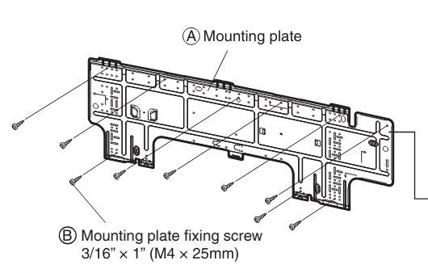
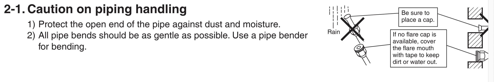
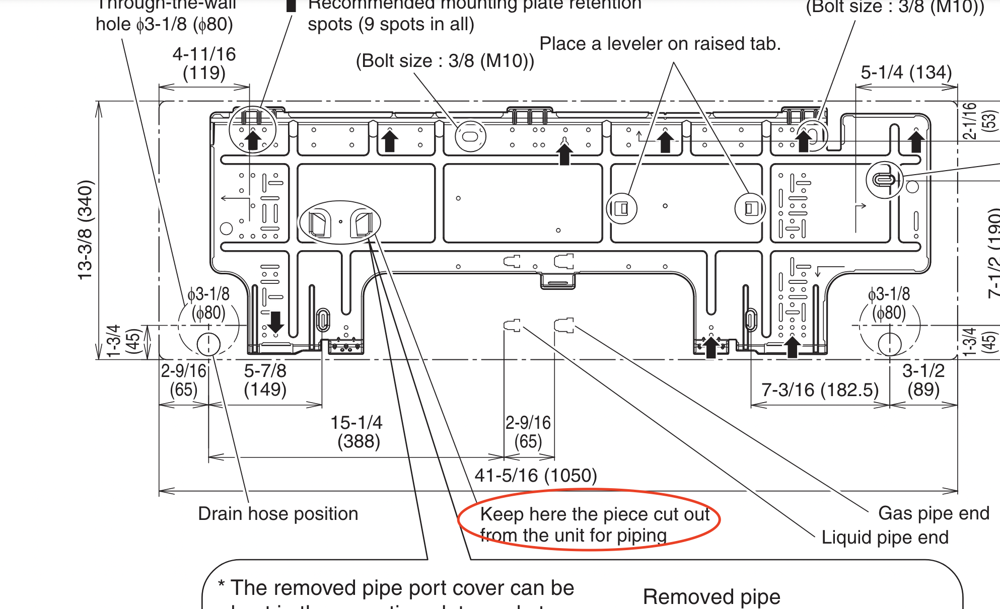

### Question 1:

**PDF Processor:**

- I would use PDFMiner.six since it is a good pdf parser and also keeps the document layout, and you can traverse it sector by sector, I can use it to implement the chunking part.
- Divide the pdf into chunks with different relevant information. This split can be done from header to header so we separate sections like Safety Precautions, Choosing an Installation Site, Indoor Unit Installation, etc. I would add the device name to the header text as well. This would ensure fast searching later on.
- Since manuals often have important information in images, I would use PyMuPDF (fitz) to extract them then use Tesseract OCR to extract the textual information that they might contain. Then add this information into corresponding chunks.
- I would structure this text information in the following way to have folders each named with the specific equipment name (the most detailed and long one), in each folder, we have files for sectors (like the text information about Safety Precautions in a file named Safety Precautions).

**Embedding:**

- Using regex I would remove special characters from text (symbols that do not contribute to semantic meaning), remove stop words using NLTK, since that might interfere with the work of embedding
- Using Universal Sentence Encoder, because it trained on massive data and does pretty good job at capturing semantic similarity necessary to handle user questions.

**Vector Database:**

- Using MongoDB to store the embedding vectors along with the file name and the sector name. It has a good vector similarity searching methods, which would be used later

**User Interface:**

- I would build the GUI using Tkinter or some other python GUI library.
- Each user question is embedded using the same USE encoder then searching through vector DB using Atlas Vector search to find the relevant embedding vectors and adding them to user input embeddings and giving it as an input to the generator.

**The LLM generator:**

- Use GPT-3s pretrained transformer, since it is already trained on huge datasets for generating human-like responses.

### Question 2:

**PDFMiner.six Limitations:**

- PDFMiner.six doesn’t handle complex layouts too well. The text extractor from images might not do much good as information that is contained there is often different equipment sectors which is something that might not be extracted. For example, this image shows the placement of components which is information that would not be extracted.

**MongoDB Limitations and Alternatives:**

- MongoDB has higher memory usage and document size limitations. However, thanks to chunking, the document size limitation should not be an issue. As for memory usage, if I notice that the responses are too slow I might consider switching the database and use Faiss for example which is also specialized for the same task.

**Chunking Strategy:**

- The chunking strategy that I use involving headers is heavily relying on my confidence that the manuals are well and similarly structured. Alternatively, I would try out something like NLTK’s sentence chunking or markdown or latex chunking.

**USE:**

- Out of vocabulary words that might be present in the manuals like product brand names, domain specific names like Solenoid valve or technical acronyms, the solution for this issue is not straightforward, I might try to look some domain specific embedding models. So far I only found out about TechBert, but since I am unable to find proper specifics of the implementation and details of this I will not incorporate this
- Generalization of the training dataset might have caused issues with the domain specific user questions, but since we are using RAGs we should be able to overcome this issue
- Fixed length embeddings would cause issues with longer technical sentences

**Generator:**

- Usage of GPT-3 which training data might be a little outdated. I avoided to use GPT-4 since I am not sure of the model availability

### Question 3:
Questions are written about the example pdf

**Questions the model will answer**

- How to install the front grille of the Daikin room air conditioner?
- Can you please list me some safety precautions I should take to ensure the correct installation of the Daikin room air conditioner?
- What should I consider before choosing a place to install the Daikin room air conditioner?
- How to set the different addresses for remote controllers of Daikin room air conditioner?
- My house wall contains a metal frame, what precautions should I take before installing wall enbedded pipes of Daikin room air conditioner?

Explanation: The questions are well formed mention the device name, which facilitates the search, exactly repeat or are similar(use a lot of key words) that are contained in the document hence I can be sure that the proper embedded vectors would be found.

**Questions the model might not answer properly**

- I am trying to connect the HA system of the Daikin room air conditioner, and I removed the front grills, electrical wiring box and cover, where should I connect the connection cord?
Explanation: The answer is contained in the following sentence "Attach the connection cord to the S21 connector and pull the harness out through the notched part in the figure."
The issue is that S21(and HA system too for that matter) is too manual specific hence it would not be properly encoded, hence the model would produce an incorrect answer

- Should I be wary if it rains on the Refrigerant pipe of the Daikin room air conditioner?

Explanation: The answer is contained in the following section, the specification to avoid way is given in a graphical manner, via the drawing of the cross, and is not told verbally, hence this information would be lost in initial stages of pdf information extraction

- I am trying to install the mounting plate of Daikin room air conditioner, what should I do with the piece that I cut from the unit.

Explanation: Again the answer to the question(specification of the location) is given in graphical form

- What are some compatible devices for bad elf flex?
Explanation: The catch here is the assumption that the manual for Bad Elf Flex is not contained in the database of manuals, hence the model would response with some made up response

- How to remove the indoor unit?
Explanation: Even though we have the question with this exact formulation in the document, the is no specification of the device or anything hence the model might anser using the information contained in a manual of another device.

